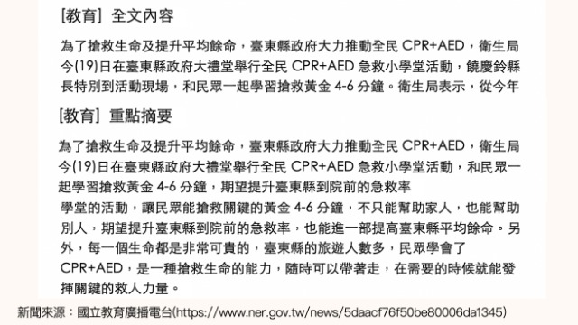
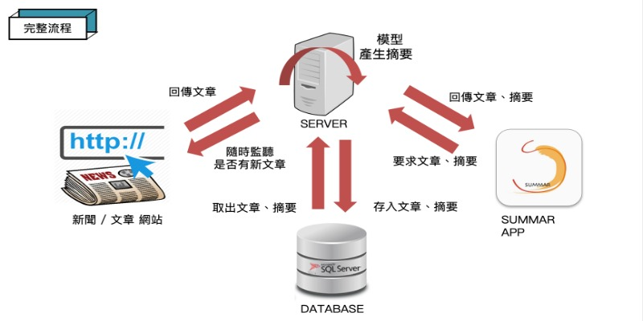
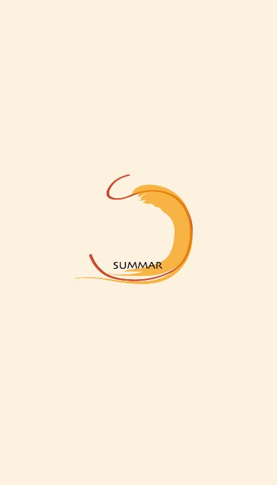

# SUMMAR
中文新聞摘要平台，將文章內容作精簡、重點化，以利使用者快速吸收文章資訊

將文章使用Python **jieba**套件，將句子轉換成多個關鍵字

再使用**TF-IDF**計算每一個詞的重要度(分數)，根據**重要度**重組成新的摘要

#### TF-IDF
TF是處理每一個「文件」中所有「詞」的問題

IDF是處理每一個「詞」在所有「文件」中的問題

透過TF和IDF算每一個「詞」對每一篇「文件」的分數

#### 介紹影片

#### 系統特色
1. An articles summarize on Android
2. Use NoSQL with MongoDB
3. Use RESTful API with Retrofit

#### Demo
